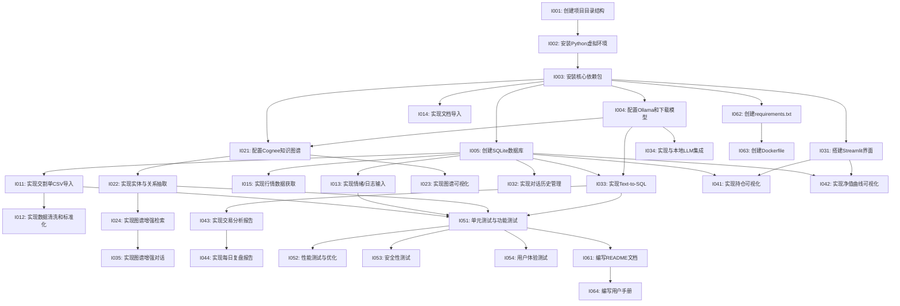

# 📋 本地化个人交易记忆系统 (MyTradeMind) 实现计划文档

## 1. 任务分解清单 (按模块/功能组织)

### 1.1 基础架构与环境设置 (Phase 1: Setup)

| 任务ID | 任务描述 | 优先级 | 预估工时 | 依赖关系 | 负责人 |
|--------|----------|--------|----------|----------|--------|
| I001 | 创建项目目录结构 | 高 | 0.5天 | 无 | 开发者 |
| I002 | 安装和配置Python虚拟环境 | 高 | 0.5天 | I001 | 开发者 |
| I003 | 安装核心依赖包 (Streamlit, Ollama, Cognee等) | 高 | 1天 | I002 | 开发者 |
| I004 | 配置Ollama和下载LLM模型 (Qwen2.5/Llama3.1) | 高 | 1天 | I003 | 开发者 |
| I005 | 创建SQLite数据库和基础表结构 | 高 | 1天 | I003 | 开发者 |

### 1.2 数据导入模块 (Phase 2: Data Ingestion)

| 任务ID | 任务描述 | 优先级 | 预估工时 | 依赖关系 | 负责人 |
|--------|----------|--------|----------|----------|--------|
| I011 | 实现交割单CSV导入功能 | 高 | 2天 | I005 | 开发者 |
| I012 | 实现交易数据清洗和标准化 | 高 | 1天 | I011 | 开发者 |
| I013 | 实现情绪/日志文本输入界面 | 高 | 1天 | I005 | 开发者 |
| I014 | 实现文档导入功能 (PDF/Markdown/TXT) | 中 | 1.5天 | I003 | 开发者 |
| I015 | 实现行情数据获取功能 (AkShare) | 中 | 1天 | I005 | 开发者 |

### 1.3 知识图谱服务 (Phase 3: Knowledge Graph)

| 任务ID | 任务描述 | 优先级 | 预估工时 | 依赖关系 | 负责人 |
|--------|----------|--------|----------|----------|--------|
| I021 | 配置Cognee知识图谱 | 高 | 1天 | I003, I004 | 开发者 |
| I022 | 实现实体与关系抽取功能 | 高 | 2天 | I021 | 开发者 |
| I023 | 实现知识图谱可视化功能 | 高 | 1天 | I021 | 开发者 |
| I024 | 实现图谱增强检索功能 | 中 | 1.5天 | I022 | 开发者 |

### 1.4 对话管理模块 (Phase 4: Chat Interface)

| 任务ID | 任务描述 | 优先级 | 预估工时 | 依赖关系 | 负责人 |
|--------|----------|--------|----------|----------|--------|
| I031 | 搭建Streamlit Web界面 | 高 | 1天 | I003 | 开发者 |
| I032 | 实现对话历史管理功能 | 高 | 1天 | I005 | 开发者 |
| I033 | 实现Text-to-SQL功能 | 高 | 2天 | I005, I004 | 开发者 |
| I034 | 实现与本地LLM的集成 | 高 | 1天 | I004 | 开发者 |
| I035 | 实现图谱增强对话功能 | 中 | 1.5天 | I024 | 开发者 |

### 1.5 数据可视化与报告 (Phase 5: Visualization)

| 任务ID | 任务描述 | 优先级 | 预估工时 | 依赖关系 | 负责人 |
|--------|----------|--------|----------|----------|--------|
| I041 | 实现持仓情况可视化 | 中 | 1天 | I005, I031 | 开发者 |
| I042 | 实现净值曲线可视化 | 中 | 1天 | I005, I031 | 开发者 |
| I043 | 实现交易分析报告生成 | 中 | 2天 | I033 | 开发者 |
| I044 | 实现每日复盘报告功能 | 低 | 2天 | I043 | 开发者 |

### 1.6 系统测试与优化 (Phase 6: Testing & Optimization)

| 任务ID | 任务描述 | 优先级 | 预估工时 | 依赖关系 | 负责人 |
|--------|----------|--------|----------|----------|--------|
| I051 | 单元测试与功能测试 | 高 | 2天 | 所有功能模块 | 开发者 |
| I052 | 性能测试与优化 | 中 | 1天 | I051 | 开发者 |
| I053 | 安全性测试 | 高 | 1天 | I051 | 开发者 |
| I054 | 用户体验测试 | 中 | 0.5天 | I051 | 开发者 |

### 1.7 文档与部署 (Phase 7: Documentation & Deployment)

| 任务ID | 任务描述 | 优先级 | 预估工时 | 依赖关系 | 负责人 |
|--------|----------|--------|----------|----------|--------|
| I061 | 编写README文档 | 高 | 1天 | 所有功能模块 | 开发者 |
| I062 | 创建requirements.txt | 高 | 0.5天 | I003 | 开发者 |
| I063 | 创建Dockerfile (可选) | 低 | 1天 | I062 | 开发者 |
| I064 | 编写用户手册 | 中 | 1天 | I061 | 开发者 |

## 2. 任务依赖关系图

## 3. 开发顺序与里程碑

### 3.1 开发顺序

1. **Phase 1: Setup (Days 1-3)**
   - 创建项目结构和环境
   - 安装依赖和配置Ollama
   - 创建数据库和基础表结构

2. **Phase 2: Data Ingestion (Days 4-7)**
   - 实现交割单CSV导入和数据清洗
   - 实现情绪/日志输入功能
   - 实现基础文档导入功能

3. **Phase 3: Knowledge Graph (Days 8-11)**
   - 配置Cognee知识图谱
   - 实现实体与关系抽取
   - 实现图谱可视化功能

4. **Phase 4: Chat Interface (Days 12-15)**
   - 搭建Streamlit Web界面
   - 实现对话历史和Text-to-SQL功能
   - 集成本地LLM和图谱增强对话

5. **Phase 5: Visualization (Days 16-18)**
   - 实现持仓和净值可视化
   - 实现交易分析报告功能

6. **Phase 6: Testing & Optimization (Days 19-21)**
   - 进行单元测试和功能测试
   - 性能测试和优化
   - 安全性测试

7. **Phase 7: Documentation & Deployment (Days 22-24)**
   - 编写README和用户手册
   - 创建requirements.txt和Dockerfile

### 3.2 里程碑

| 里程碑ID | 里程碑描述 | 完成日期 | 交付物 |
|----------|------------|----------|--------|
| M01 | 项目环境搭建完成 | Day 3 | 配置好的Python环境、安装的依赖包、数据库结构 |
| M02 | 数据导入功能完成 | Day 7 | 可运行的交割单导入、情绪/日志输入功能 |
| M03 | 知识图谱功能完成 | Day 11 | 可运行的知识图谱构建和可视化功能 |
| M04 | MVP核心功能完成 | Day 15 | 可运行的Web界面、对话功能、Text-to-SQL功能 |
| M05 | 完整功能完成 | Day 18 | 包含所有功能的完整系统 |
| M06 | 测试和优化完成 | Day 21 | 通过测试的稳定系统 |
| M07 | 文档和部署完成 | Day 24 | 完整的文档和可部署的系统 |

## 4. 测试策略

### 4.1 单元测试
- 使用Python unittest框架进行单元测试
- 针对核心函数和模块编写测试用例
- 测试覆盖率目标：80%以上

### 4.2 功能测试
- 手动测试所有功能模块
- 验证功能是否符合需求规格
- 测试边界条件和异常情况

### 4.3 性能测试
- 测试数据导入速度
- 测试LLM响应时间
- 测试图谱构建和查询性能

### 4.4 安全性测试
- 验证数据本地存储
- 测试未授权访问防护
- 验证无外部数据泄露

### 4.5 用户体验测试
- 测试Web界面易用性
- 测试对话交互流畅性
- 测试图谱可视化效果

## 5. 交付物清单

### 5.1 代码交付物
- 完整的项目源代码
- 配置文件
- 测试脚本

### 5.2 文档交付物
- README.md：项目说明和快速开始指南
- requirements.txt：依赖包列表
- Dockerfile (可选)：Docker部署配置
- 用户手册：详细使用说明

### 5.3 示例数据
- 示例交割单CSV文件
- 示例策略文档
- 示例情绪/日志记录

### 5.4 其他交付物
- 知识图谱可视化示例
- 测试报告
- 性能优化报告

## 6. MVP阶段重点

### 6.1 MVP核心功能

1. **数据导入 (F1.1, F1.3)**
   - 交割单CSV导入SQLite
   - 情绪/日志文本输入

2. **图谱构建核心 (F2.1)**
   - Cognee配置和实体关系抽取
   - 确保[情绪]->[交易事件]关系抽取成功

3. **图谱可视化 (F2.2)**
   - 生成交互式HTML图谱
   - 证明Cognee成功工作

4. **基础对话 (F3.1, F3.2)**
   - Streamlit界面搭建
   - 基本Chat功能实现
   - 简单Text-to-SQL查询功能

### 6.2 MVP交付标准

- 所有核心功能可正常运行
- 数据本地存储，无云端依赖
- LLM在本地运行，确保隐私
- 提供基本的用户界面
- 系统稳定，无重大bug

## 7. 风险评估与缓解措施

| 风险类型 | 风险描述 | 影响程度 | 概率 | 缓解措施 |
|----------|----------|----------|------|----------|
| 技术风险 | Ollama本地模型性能不足 | 中 | 高 | 提供多种模型选择，优化Prompt设计 |
| 技术风险 | Cognee实体关系抽取准确率低 | 中 | 中 | 设计专门Prompt模板，提供人工校正功能 |
| 技术风险 | 不同券商交割单格式兼容性问题 | 中 | 高 | 支持多种格式识别，提供数据映射界面 |
| 时间风险 | 项目进度延迟 | 中 | 中 | 严格控制MVP范围，优先实现核心功能 |
| 质量风险 | 代码质量不达标 | 低 | 中 | 进行单元测试和代码审查 |
| 安全风险 | 数据泄露风险 | 高 | 低 | 确保所有数据本地存储，禁用外部API调用 |

## 8. 后续迭代计划

### 8.1 第二阶段迭代 (高级功能)
- 实现高级图谱分析和时间序列分析
- 支持多模型集成和切换
- 实现Web Scrapping Agent获取板块新闻
- 优化用户界面和用户体验

### 8.2 第三阶段迭代 (扩展功能)
- 支持多用户模式
- 实现数据导出功能
- 支持更多数据可视化图表
- 提供更高级的交易分析功能

### 8.3 长期维护计划
- 定期更新依赖包版本
- 优化系统性能
- 修复bug和安全漏洞
- 根据用户反馈添加新功能
